# 🏭 Sistema IoT Industrial - Gestione Impianto

Un sistema completo di monitoraggio industriale che simula un impianto di produzione con 4 macchine, raccoglie dati in tempo reale e li visualizza su dashboard interattive.

## 🎯 Obiettivo

Realizzare l'architettura completa end-to-end richiesta dall'esercitazione:
- **Ingestione eventi** da sensori e macchine
- **Processamento** dati in tempo reale con rilevamento anomalie
- **Persistenza** in database time-series
- **Visualizzazione** tramite dashboard web

## 🏗️ Architettura

```mermaid
graph LR
    SIM[🤖 Simulatore<br/>4 Macchine] -->|MQTT| PROC[⚙️ Event Processor<br/>Python]
    PROC -->|SQL| DB[(📊 InfluxDB)]
    DB -->|Query| DASH[📈 Grafana<br/>Dashboard]
    
    MQTT[📡 MQTT Broker] -.-> SIM
    MQTT -.-> PROC
```



**Flusso dati:**
1. Il **simulatore** genera dati realistici di 4 macchine (temperatura, potenza, eventi)
2. I dati vengono inviati via **MQTT** al broker
3. L'**Event Processor** riceve, valida e trasforma i dati
4. I dati puliti vengono salvati in **InfluxDB** (database time-series)
5. **Grafana** legge dal database e mostra dashboard real-time

## 🗄️ Database - InfluxDB

**Perché InfluxDB?** Ottimizzato per dati temporali IoT ad alta frequenza.

### Schema Database

**4 tabelle principali:**

| Tabella | Frequenza | Cosa contiene |
|---------|-----------|---------------|
| `sensor_data` | 3 secondi | Temperatura, potenza, RPM, vibrazioni |
| `machine_events` | Su evento | Setup utensili, inizio/fine lavorazione |
| `piece_tracking` | Su movimento | Tracciamento pezzi tra stazioni |
| `system_tracking` | 30 secondi | Performance del sistema (CPU, memoria) |

### Struttura Dati Esempio

```json
// Dato sensore
{
  "measurement": "sensor_data",
  "tags": {
    "machine": "Milling1",
    "machine_type": "Milling"
  },
  "fields": {
    "temperature": 67.5,
    "power": 3.2,
    "vibration_level": 1.8
  },
  "time": "2025-06-02T14:30:00Z"
}
```

### Retention Policy
- **industrial_data**: 7 giorni (dati operativi)
- **alerts**: 30 giorni (allarmi)
- **historical_data**: 1 anno (aggregati)

## ⚙️ Event Processor

Servizio Python che fa il lavoro pesante:

### Cosa fa
- **Riceve messaggi MQTT** dai simulatori
- **Valida e trasforma** i dati JSON
- **Rileva anomalie** in tempo reale:
  - Temperature > 80°C (warning) / > 90°C (critical)
  - Vibrazioni > 2.5g
  - Consumi anomali
- **Scrive nel database** in batch per performance
- **Monitora se stesso** (CPU, memoria, errori)

### Moduli principali
- `mqtt_client.py` - Connessione MQTT asincrona
- `data_processor.py` - Trasformazione dati + anomaly detection
- `influx_writer.py` - Scrittura ottimizzata su InfluxDB
- `system_tracker.py` - Monitoraggio performance

## 🤖 Simulatore Impianto

Simula un impianto reale con **4 macchine**:

| Macchina | Tipo | Sensori | Operazioni |
|----------|------|---------|------------|
| **Saw1** | Sega | blade_speed, temperature | Taglio materiale |
| **Milling1/2** | Fresatrici | rpm, feed_rate, temperature, vibration | Fresatura |
| **Lathe1** | Tornio | rpm, cut_depth, temperature | Tornitura |

### Caratteristiche Realistiche
- **Modello termico**: Le macchine si riscaldano durante il lavoro
- **Usura utensili**: Gli utensili si consumano e influenzano le vibrazioni
- **Workflow completo**: I pezzi si muovono tra stazioni (Warehouse → Saw → Milling/Lathe → Warehouse)
- **Eventi temporizzati**: Setup utensili, inizio/fine lavorazione, trasporti

### Configurazione
```bash
TIME_MULTIPLIER=10    # Velocità simulazione (10x più veloce)
PIECE_COUNT=5         # Numero pezzi da processare
```

## 📊 Dashboard Grafana

Dashboard web con **6 pannelli principali**:

1. **🌡️ Temperature Trend** - Andamento temperatura per macchina
2. **⚡ Consumo Energetico** - Potenza in tempo reale
3. **📦 Produzione** - Contatore pezzi completati
4. **🚨 Allarmi Critici** - Contatore alert attivi
5. **📋 Tabella Alert** - Lista allarmi con timestamp e severità
6. **💻 Performance Sistema** - CPU/memoria event processor

### Funzionalità
- **Auto-refresh** ogni 5 secondi
- **Filtri per macchina** (dropdown)
- **Range temporali** (30min, 1h, 6h, 24h)
- **Color-coding** per allarmi (giallo=warning, rosso=critical)

## 🚀 Come Avviare

### Prerequisiti
- Docker & Docker Compose
- 4GB RAM liberi
- Porte: 1883 (MQTT), 8086 (InfluxDB), 3000 (Grafana)

### Avvio Rapido
```bash
# 1. Clona repository
git clone <repo-url>
cd esercitazione-gestione-impianto

# 2. Avvia tutti i servizi
docker-compose up -d

# 3. Avvia simulazione
docker-compose up simulator

# 4. Accedi alle interfacce
# Grafana: http://localhost:3000 (admin/admin123)
# InfluxDB: http://localhost:8086 (admin/admin123)
```

### Verificare che Funzioni
```bash
# Controlla servizi attivi
docker-compose ps

# Guarda logs del processor
docker-compose logs -f event-processor

# Valida database
python database/validate_data.py
```

## 🔧 Troubleshooting

| Problema | Soluzione |
|----------|-----------|
| Grafana non mostra dati | Verifica che il simulatore stia girando |
| Event processor si disconnette | Controlla che mosquitto sia avviato |
| Database errori | Restart: `docker-compose restart influxdb` |
| Performance lente | Riduci TIME_MULTIPLIER del simulatore |

## 📁 Struttura File

```
├── simulator/           # Simulatore 4 macchine
├── mqtt-processor/      # Event processor Python
├── database/           # Setup e schema InfluxDB
├── dashboard/          # Dashboard Grafana
├── config/             # Configurazioni (mosquitto)
└── docker-compose.yml  # Orchestrazione completa
```

## ✅ Requisiti Esercitazione

| Requisito | Implementazione | Status |
|-----------|----------------|--------|
| **Database adatto** | InfluxDB time-series | ✅ |
| **Schema definito** | 4 measurements, retention policies | ✅ |
| **Query fondamentali** | 15+ query Flux per analytics | ✅ |
| **Event Processor** | Python async, MQTT → InfluxDB | ✅ |
| **Trasformazione dati** | JSON validation, anomaly detection | ✅ |
| **Dashboard web** | Grafana, 6 pannelli real-time | ✅ |
| **Grafici tempo reale** | Refresh 5s, temperature/power | ✅ |
| **Tabella eventi** | Alert table con color-coding | ✅ |
| **Stato impianto** | KPI produzione, machine status | ✅ |
| **Filtri** | Macchina, tempo, soglie | ✅ |
| **Simulatore avanzato** | 4 macchine, modelli fisici | ✅ |
| **Processori opzionali** | Anomaly detection, predictive maintenance | ✅ |

## 🎯 Demo (5 minuti)

1. **[1 min]** Mostra architettura: `docker-compose ps`
2. **[2 min]** Avvia simulazione: `docker-compose up simulator`
3. **[1.5 min]** Dashboard live: http://localhost:3000
4. **[0.5 min]** Anomaly detection: temperatura > 80°C trigger alert

**Punti forti da evidenziare:**
- Sistema end-to-end completo e funzionante
- Anomaly detection automatico
- Dashboard professionale
- Codice production-ready con Docker